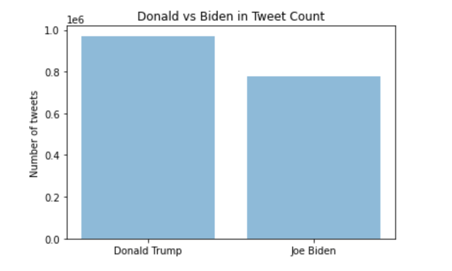

#### Research Overview  
  
The current research takes an analytical dive into the 2020 US Presidential Election with Twitter data. Every day, millions of hashtags are created on Twitter, making it one of the largest social media platforms for people to post about their thoughts, beliefs and opinions. Alongside with the growth and expansion of Twitter as a platform is its increasing influence on politics. Donald J. Trump, the incumbent president in this presidential race, has 88.9 million followers on Twitter, making him the 7th most followed person on Twitter. President Trump is also comfortable with communicating and announcing his presidential actions through Twitter. The abundance of data has allowed the current research to extract all of the tweets from Oct 15th to Nov 8th with hashtags of “DonaldTrump” and “JoeBiden”. Since the election results turned out to be close and contentious, this dataset provides an angle to explore which candidate is more popular on Twitter and what the geographic distribution for each hashtag looks like. Specifically, the research questions are centered around the top regions (cities, states, countries) with the most counts of each hashtags and the tweet sentiment of each hashtags across time and location.  

#### Data and Large-scale Techniques  
  
The pipeline for conducting the abovementioned analytics includes storing data, cleaning data, running exploratory analysis, performing sentiment analysis and rendering results with visualizations.   
  
The dataset contains 2 csv files, with information for each hashtag respectively. 2 dataset combines to have 1.75 million rows, 21 columns that include tweet content, number of likes, user_name, user_location, city, state, country and other information. Since the data is very difficult to process on a local machine, large-scale computing techniques have been leveraged. First, the data has been uploaded to AWS S3 under the bucket name “twitter-election”. An 8-core EMR cluster and notebook have then been created. The data pipelining has been conducted with the help of S3FS, which is built on botocore to provide Python filesystem interface for S3. Pandas and matplotlib are the main tools for data cleaning and exploratory data analysis. The cleaned data was stored to S3. A PySpark notebook is then started to conduct text preprocessing, sentiment analysis and data manipulation. The data is accessed again by Pandas to render data visualizations.  
  
#### Results  
  
From Oct 15th to Nov 8th in 2020, there are 970919 and 776886 tweets containing Trump hashtags and Biden hashtags respectively, while 7259572 likes were awarded to Trump and 7894066 to Biden. In terms of retweets, 1649106 and 1655801 retweets for Trump and Biden tweets respectively. Overall, there are around 200 thousand more tweets with hashtags of Trump than Biden. On the other hand, interestingly, Biden tweets have both more likes and more retweets. Counts alone are not evidence for popularity, because the sentiment of tweets is unknown.    
  
  
  
The top 5 countries with Trump and Biden hashtags are United States, United Kingdom, India, France and Germany. India is the only country which has more tweets with hashtags of Biden. State wise, California, New York, Texas, Florida and District of Columbia are the top 5 locations for the tweets. As for the cities, New York has more than double the counts than Los Angeles, suggesting a more concentrated population. The 2020 Election Map shows that the states of California and New York have chosen to vote for Joe Biden by a significant margin, whereas Texas and Florida, which are ranked 3rd and 4th for tweet count, voted for Donald Trump. It is clear that more tweets come from “blue states” than “red states”, which is inconsistent with the total counts of tweets for each candidate. This could potentially suggest a lower polarity (sentiment) score for Trump than for Biden.  
  
  
  
To confirm the speculation, sentiment analysis is conducted on the tweets. First, all tweets are cleaned to remove links, brackets, punctuations, numbers and converted to lower case. Then, textblob’s sentiment package is leveraged to receive quantitative polarity scores and qualitative sentiment classifications. The average overall polarity is 0.042 for Trump and 0.070 for Biden, showing more positive sentiment for Biden across all locations. In absolute counts, Trump tweets outnumber Biden tweets in all neutral (polarity = 0), positive (polarity > 0) and negative (polarity < 0). However, in proportion, Biden tweets have higher neutral and positive percentage than Trump’s, whereas Trump tweets have higher negative percentage than Biden’s.  
  
  
When grouped by locations, there are some interesting findings as well. Across all the states in the US, Alabama has the highest average polarity score of 0.075 and Guam has the lowest, and the only negative polarity score of -0.25 for Trump. Alabama has voted Republican in every presidential election since 1980, so it is not surprising to find it to be the most positive state for Trump on Twitter. Guam, on the other hand, only has 4 tweets for Trump so the sample size is not very significant. For Biden, Northern Mariana Islands have 1 tweet with the polarity score of 0.25 for Biden. After disregarding this outlier, Arkansas turned out to be the most positive state for Biden on Twitter, followed by New Mexico and New Hampshire.   
  
  
Besides states, similar analytics have been run on countries and cities. The results are indicated by the graphs and this report is not going to expand on these two parts due to the length limit.  
  
  
  
  
  
  
Since this dataset has a time frame from weeks before the election until one week after, it is valuable to sketch up the trajectories of sentiment across time. As both the US and world graphs suggest, Biden tweets have on average more positive sentiment across the period. The difference narrowed down a few days before Nov 3rd and drastically widened after, presumably when Biden was announced the winner.  
  
 
  
#### Conclusion  
  
In summary, the current research analyzes the tweets with hashtags of Donald Trump and Joe Biden in the period from Oct 15th to Nov 8th in 2020. AWS S3, EMR and PySpark have been used for exploratory analysis, sentiment analysis and time series analysis. The dataset suggests that, though there are more tweets with “#DonaldTrump”, tweets with “#JoeBiden” have more likes, retweets and more positive sentiment polarity. The trend shows that tweets with hashtag Biden have consistently more positive sentiment across time, with a narrowing gap before Nov 3rd and widening gap after.